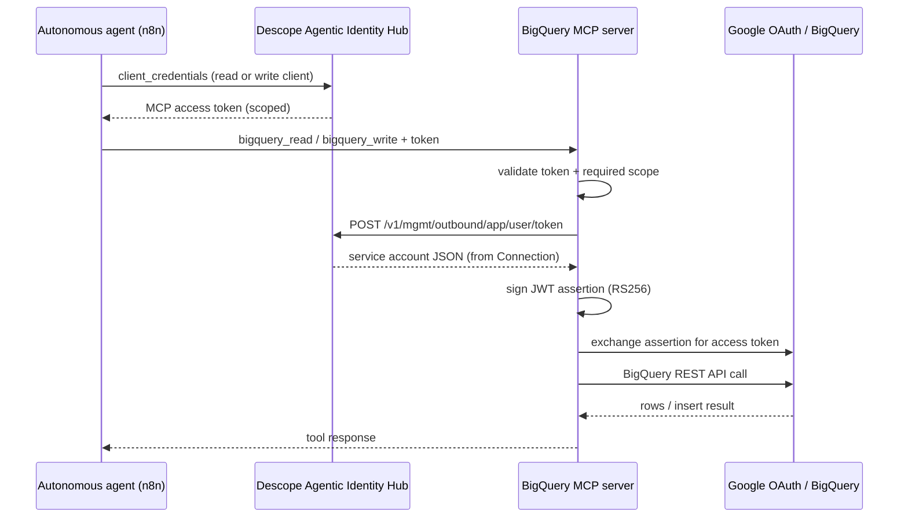

# BigQuery MCP Server with Descope

Companion sample for the Descope blog post [Identity for Autonomous Agents](https://www.descope.com/blog/post/identity-for-autonomous-agents).

This repository is a **FastMCP server** that exposes BigQuery read and write tools to autonomous agents (for example, n8n workflows). Callers authenticate with Descope using non-interactive OAuth (`client_credentials`). The server enforces tool-level scopes, fetches BigQuery service account credentials from Descope Connections at call time, and never stores Google private keys in workflow config or source code.

## What this example demonstrates

Many teams give each automation its own BigQuery credentials and duplicate tool definitions across workflows. That leads to secrets sprawl and weak separation between read and write access.

This sample shows a better pattern:

- **One internal MCP server** defines BigQuery tools once.
- **Autonomous agents** (n8n workflows, background jobs, bots) authenticate as OAuth clients.
- **Descope policies** control which scopes each agent can request.
- **BigQuery credentials** live in Descope Connections and are fetched just-in-time per request.
- The **MCP access token** only authorizes the tool call; Google access is minted downstream and discarded after use.

The MCP token gets the agent through the front door. The server fetches what it needs to do the actual work.

## Architecture



## Tools

| Tool | Purpose | Required scope | Descope Connection |
| --- | --- | --- | --- |
| `bigquery_read` | Read rows via `tabledata.list` | `mcp:bigquery.read` | `bigquery-read-cert` |
| `bigquery_write` | Insert rows via `insertAll` | `mcp:bigquery.write` | `bigquery-readwrite-cert` |

Each tool selects its Connection dynamically. Read and write credentials stay separate even though both tools are defined in one server.

## Descope setup

Follow the blog's n8n + BigQuery walkthrough, then point your agents at this server.

### 1. Create the MCP server resource

In [Agentic Identity Hub → MCP Servers](https://app.descope.com/mcp-servers):

1. Create a new MCP server.
2. Enable **Dynamic Client Registration (DCR)** (and CIMD if needed for your clients).
3. Add scopes:
   - `mcp:bigquery.read` — read rows from BigQuery
   - `mcp:bigquery.write` — insert rows into BigQuery
4. Copy the **Well-Known URL** (your `DESCOPE_CONFIG_URL`).

### 2. Store BigQuery credentials in Connections

In [Agentic Identity Hub → Connections](https://docs.descope.com/agentic-identity-hub/core-components/connections):

1. Create `bigquery-read-cert` with a read-only BigQuery service account JSON.
2. Create `bigquery-readwrite-cert` with a read/write BigQuery service account JSON.

Service account private keys should live **only** in Descope Connections.

### 3. Create agentic clients (one per workflow)

Create one OAuth client per autonomous agent, both using `client_credentials`:

- **Read workflow client** — policy allows only `mcp:bigquery.read`
- **Write workflow client** — policy allows only `mcp:bigquery.write`

A workflow cannot escalate beyond its client's allowed scopes, even if someone edits the workflow definition later.

See the blog post for example policy screenshots and client configuration.

### 4. Register this server's URL

After deploying (or running locally), add your MCP endpoint to **MCP Server URLs** in the Descope Console:

```text
https://<your-host>/mcp
```

## n8n setup (example caller)

This server is designed to be called by non-interactive agents such as n8n workflows:

1. Point each workflow at this MCP server's `/mcp` endpoint.
2. Authenticate with the workflow's Descope client ID and secret (`client_credentials`).
3. Call `bigquery_read` or `bigquery_write` with the returned access token.
4. Gate the write workflow in n8n so only authorized users can trigger it.

n8n controls **who can start** a workflow. Descope policy controls **what the agent can do** once it runs.

## What the server does on each call

All logic lives in [`server.py`](server.py). Every tool call runs the same sequence:

1. The MCP client calls a tool with its access token.
2. The server validates the token and the scope the tool requires.
3. It reads the caller's identity from the token's `sub` claim.
4. It calls the [Descope Management API](https://docs.descope.com/agentic-identity-hub/core-components/connections/fetching-connection-tokens):
   - `POST /v1/mgmt/outbound/app/user/token`
   - `bigquery_read` uses Connection `bigquery-read-cert`
   - `bigquery_write` uses Connection `bigquery-readwrite-cert`
5. It extracts the service account JSON from the Descope response.
6. It signs a JWT assertion with the service account private key (`RS256`).
7. It exchanges that assertion at Google's OAuth token endpoint for an access token.
8. It calls the BigQuery REST API with that token.

## Prerequisites

- Python 3.13+
- [uv](https://docs.astral.sh/uv/)
- A [Descope](https://www.descope.com) project with Agentic Identity Hub configured
- BigQuery dataset/table access for the service accounts stored in Connections

## Local development

```bash
# Install dependencies
uv sync

# Copy and fill in environment variables
cp .env.example .env

export DESCOPE_CONFIG_URL="https://api.descope.com/v1/apps/agentic/P.../M.../.well-known/openid-configuration"
export SERVER_URL="http://localhost:8000"

# Optional: override Connection IDs
export BIGQUERY_READ_OUTBOUND_APP_ID="bigquery-read-cert"
export BIGQUERY_WRITE_OUTBOUND_APP_ID="bigquery-readwrite-cert"

# Run the server
uv run server.py
```

The MCP endpoint is available at `http://localhost:8000/mcp`.

Connect an MCP client (Cursor, Claude Desktop, n8n, etc.) to that URL and complete the Descope OAuth flow for your agentic client.

## Deploy on Render

[](https://render.com/deploy)

1. Fork this repository.
2. Import the [`render.yaml`](render.yaml) Blueprint in Render.
3. Set `DESCOPE_CONFIG_URL` in the Render Dashboard.
4. After deploy, copy your service URL, append `/mcp`, and add it to **MCP Server URLs** in Descope.

`RENDER_EXTERNAL_URL` is set automatically by Render and used as the server's public base URL.

> **Note:** The free Render plan spins down after inactivity. MCP clients may time out on cold starts. Use a paid plan for always-on agents.

## Environment variables

| Variable | Required | Description |
| --- | --- | --- |
| `DESCOPE_CONFIG_URL` | Yes | Well-Known OIDC URL from Descope MCP Server settings |
| `SERVER_URL` | Local only | Public base URL when not running on Render (e.g. `http://localhost:8000`) |
| `BIGQUERY_READ_OUTBOUND_APP_ID` | No | Connection ID for read credentials (default: `bigquery-read-cert`) |
| `BIGQUERY_WRITE_OUTBOUND_APP_ID` | No | Connection ID for write credentials (default: `bigquery-readwrite-cert`) |
| `DESCOPE_MGMT_API_KEY` | No | Fallback bearer for Connection fetch during local dev (`<PROJECT_ID>:<token>`) |
| `DESCOPE_MANAGEMENT_KEY` | No | Descope management key for SDK initialization |
| `DESCOPE_PROJECT_ID` | No | Override project ID parsing from `DESCOPE_CONFIG_URL` |
| `DESCOPE_MGMT_API_BASE_URL` | No | Defaults to `https://api.descope.com` |

In production, Connection credentials are fetched using the caller's MCP access token (`Authorization: Bearer <PROJECT_ID>:<mcp-access-token>`), which enables Descope policy enforcement on outbound access.

## BigQuery API endpoints used

- **Read:** `GET /bigquery/v2/projects/{project}/datasets/{dataset}/tables/{table}/data`
- **Write:** `POST /bigquery/v2/projects/{project}/datasets/{dataset}/tables/{table}/insertAll`

## Security model

- No hardcoded secrets or service account keys in source code.
- Tool-level scopes are enforced on every call before any outbound request.
- Read and write credentials are stored in separate Descope Connections.
- Google access tokens are short-lived and minted per request.
- Autonomous agents receive dedicated OAuth client identities with auditable access.

## Learn more

- [Identity for Autonomous Agents (blog post)](https://www.descope.com/blog/post/identity-for-autonomous-agents)
- [Descope Agentic Identity Hub docs](https://docs.descope.com/agentic-identity-hub)
- [Fetching Connection tokens](https://docs.descope.com/agentic-identity-hub/core-components/connections/fetching-connection-tokens)
- [Descope MCP Python SDK](https://docs.descope.com/mcp/python-sdk)
- [FastMCP](https://gofastmcp.com/getting-started/welcome)
- [MCP Authorization spec](https://modelcontextprotocol.io/specification/2025-11-25/basic/authorization)
